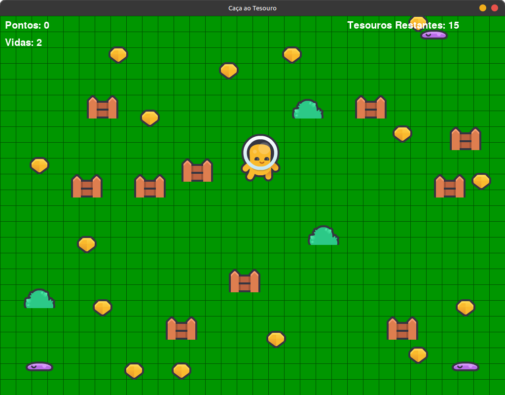

# 🪙 Caça ao Tesouro  




## 🎮 Visão Geral

> "Caça ao Tesouro" é um jogo de **movimentos em turnos** no estilo **Roguelike leve**, onde cada decisão pode ser a diferença entre a vitória e a derrota.

Você controla um aventureiro em um mapa gerado aleatoriamente.  
O objetivo é **coletar todos os tesouros** sem ser pego pelos inimigos.  

## Dependências:

### Distros baseadas em Debian 

```bash
 sudo apt install python3-pgzero
```

### Via PIP

```bash
pip install pgzero
```

## Como jogar 

### Clonar o repositório GITHUB:

```bash:
git clone https://github.com/selrahcsan/tesouro
```

### Clonar o repositório GITLAB:

```bash:
git clone https://gitlab.com/charlesstna/tesouro.git
```

## Como Executar:


```bash:
cd tesouro
pgzrun game.py
```
